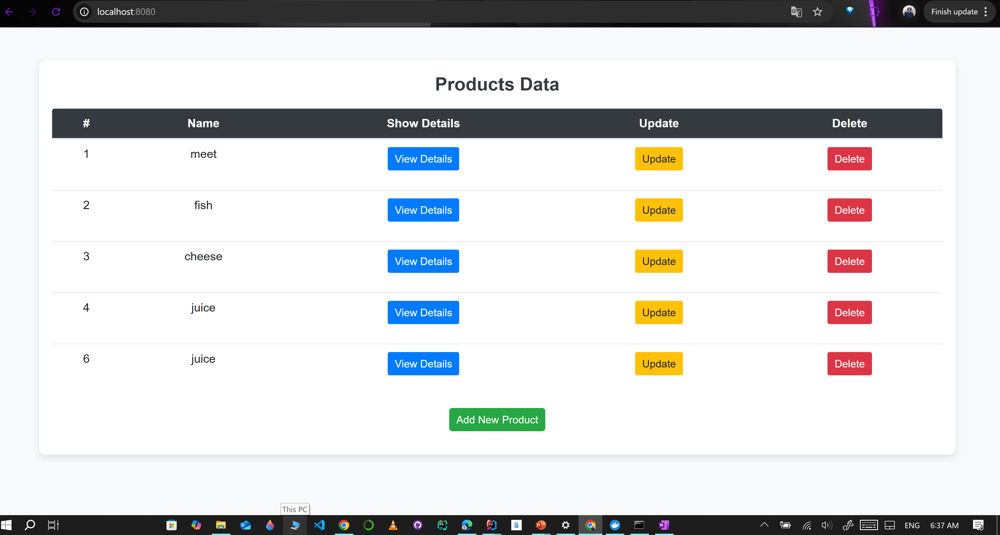
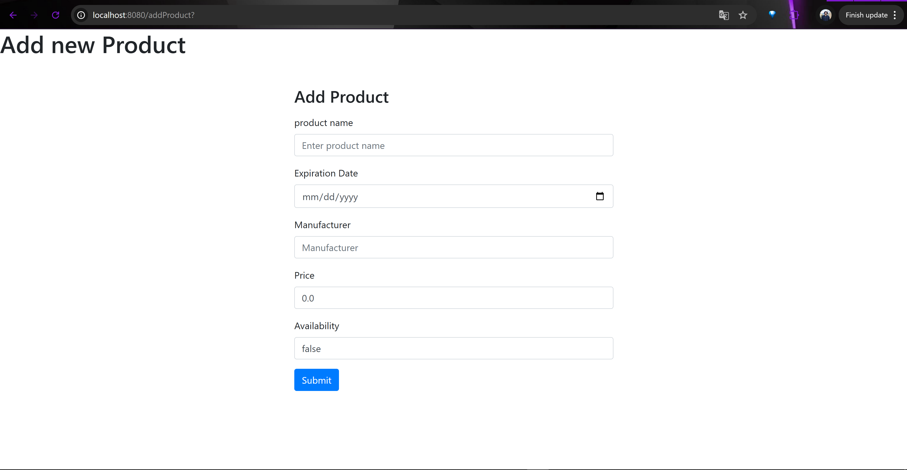
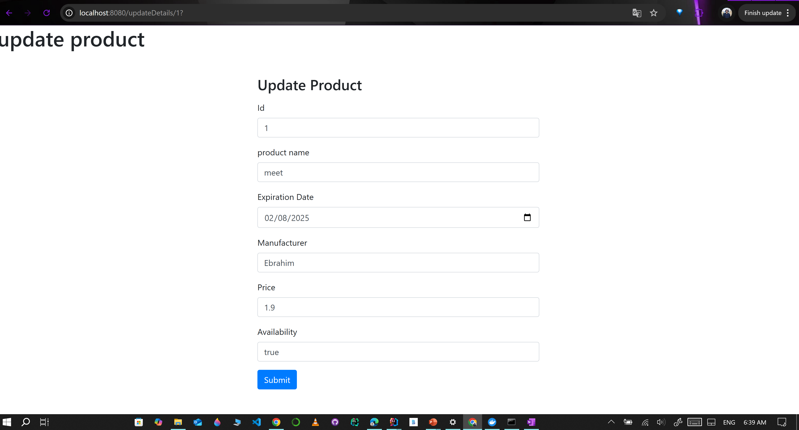
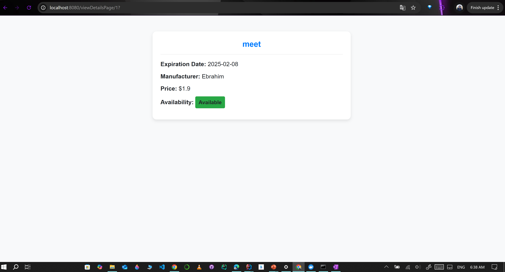

# Admin panel app

## Table of Contents
- [`Introduction`](#introduction)
- [`Technologies Used`](#technologies-used)
- [`Features`](#features)
- [`Prerequisites`](#prerequisites)
- [`Quick start`](#Quick-start)
- [`Usage`](#usage)
- [`Views`](#Views)
- [`Contributing`](#contributing)


## Introduction
This is a simple CRUD (Create, Read, Update, Delete) application built using **Spring MVC**, **Hibernate ORM**, and **MySQL** database. The project leverages **Docker** for containerization, **Maven** for dependency management, and runs on the **Apache Tomcat** server. This application demonstrates how to perform basic CRUD operations in a web-based environment 
## Technologies Used
- **Spring MVC**: For handling the Model-View-Controller architecture.
- **Hibernate ORM**: For object-relational mapping and interaction with the MySQL database <button class="citation-flag" data-index="5">
- **MySQL**: As the relational database management system to store application data.
- **Docker**: To containerize the MySQL database for easy deployment and consistency across environments.
- **Maven**: For managing project dependencies and building the application.
- **Apache Tomcat**: As the servlet container where the application is deployed and run.

## Features
- **Create**: Add new records into the database.
- **Read**: Retrieve and display existing records from the database.
- **Update**: Modify the details of existing records.
- **Delete**: Remove unwanted records from the database.

## Prerequisites
Before you begin, ensure you have met the following requirements:
- Java Development Kit (JDK) 8 or higher installed on your machine.
- Maven installed and configured.
- Docker installed for running the MySQL database container.
- knowledge of Spring MVC, Hibernate, and MySQL.

## Quick start
1. **Clone the Repository**:
   ```bash
   git clone https://github.com/EbrahimMohamed-1/CRUD-app.git
   cd CRUD-app
   ```
2. **Set Up MySQL Database with Docker**:
   - Start a MySQL container using Docker:
     ```bash
     docker container run -d --name mysqldatabase -p 3307:3306 -e MYSQL_ROOT_PASSWORD=root mysql:latest
      ```
3. **Build the Project**:
   - Use Maven to build the project:
     ```bash
     mvn clean install
     ```
4. **Deploy to Tomcat**:
   - Copy the generated `.war` file from the `target` directory to the `webapps` directory of your Tomcat server.
   - Start the Tomcat server.

## Usage
Once the application is deployed and the server is running, navigate to `http://localhost:8080` in your web browser to access the application interface. From here, you can perform CRUD operations as needed.

## Views
- **Home**

<br>

- **Add**

<br>

- **Update**

<br>

- **Details**

<br>


## Contributing
Contributions are welcome! If you find any issues or have suggestions for improvements, please open an issue or submit a pull request.
